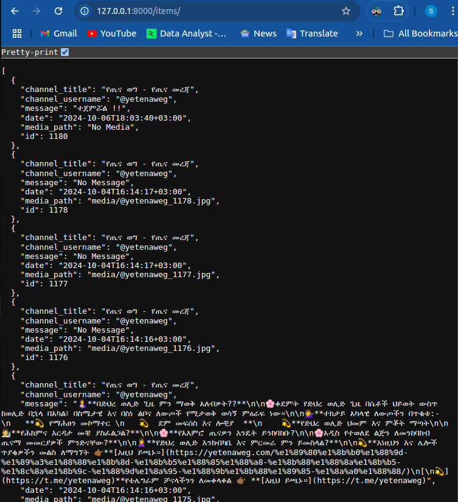
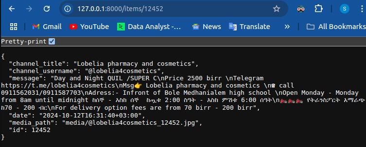
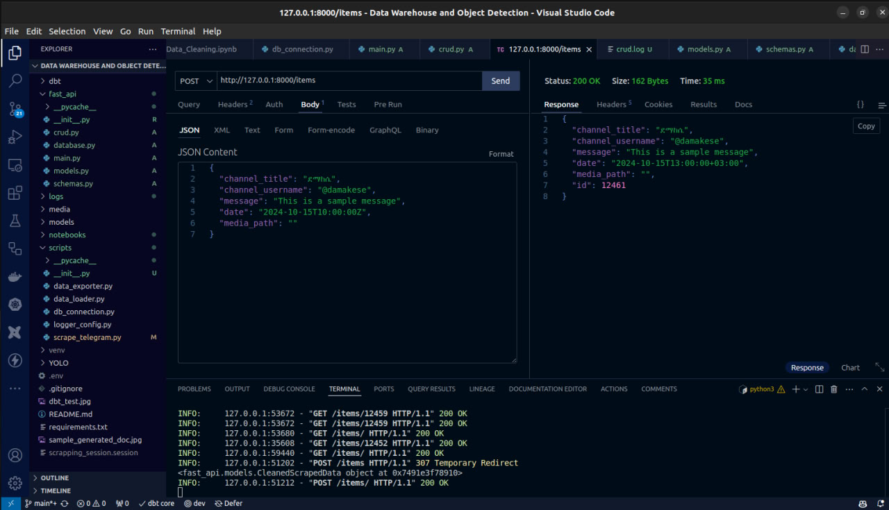

# FastAPI Application for Data Management

## Overview
This FastAPI application manages data scraped from Telegram channels, providing CRUD operations (Create, Read, Update, Delete) on the `cleaned_scraped_data` table. It leverages FastAPI, SQLAlchemy, PostgreSQL, and Pydantic for data validation and serialization.

## Technologies Used
- **FastAPI**: Modern web framework for building APIs.
- **SQLAlchemy**: ORM (Object-Relational Mapper) for interacting with the database.
- **PostgreSQL**: Relational database to store scraped data.
- **Pydantic**: Python library for data validation and serialization.
- **Logging**: Custom logging configuration for application event tracking.

## Getting Started

### 1. Cloning the Repository
Clone this repository to your local machine:

```bash
git clone <repository_url>
cd <repository_name>
```
2. Setting Up the Environment
Create a virtual environment and install the required dependencies:
```bash
python -m venv venv
source venv/bin/activate  # On Windows, use: `venv\Scripts\activate`
pip install -r requirements.txt
```
### 3. Database Configuration
Configure the database connection using SQLAlchemy in `database.py`. Ensure that your PostgreSQL database is running, and update the connection string in `database.py` to match your database credentials.

### 4. Creating Data Models
Define the SQLAlchemy models for the database tables in `models.py`. The primary table in this project is the `cleaned_scraped_data` table, which stores the scraped data from Telegram channels.

### 5. Creating Pydantic Schemas
In `schemas.py`, define Pydantic schemas to validate and serialize input/output data for the API.

### 6. CRUD Operations
CRUD (Create, Read, Update, Delete) operations are implemented in `crud.py`. This includes functions for adding new data, fetching individual or multiple records, and updating or deleting entries.

### 7. Creating API Endpoints
API endpoints are defined in `main.py`. The key endpoints include:

- **POST /items/**: Create a new item.
- **GET /items/**: Fetch a list of items.
- **GET /items/{item_id}**: Fetch a specific item by ID.

### 8. Running the Application
To start the FastAPI server, run the following command:

```bash
uvicorn main:app --reload
```
This will launch the application, making it accessible at http://127.0.0.1:8000. You can explore the interactive API documentation at http://127.0.0.1:8000/docs.

### 9. Logging
Custom logging is set up to track key events such as data creation, retrieval, and errors. Logs are stored in the `logs/` directory for easy access and monitoring.

### 10. API Testing
The API can be tested using tools like Thunder Client, Postman, or cURL. Screenshots demonstrating successful tests of the following endpoints are available in the `/` directory:

- **GET /items/**: Fetch all items.



- **GET /items/{item_id}**: Fetch a specific item by ID.



- **POST /items/**: Create a new item.



## Conclusion
This FastAPI application provides a complete solution for managing scraped data from Telegram channels, with full CRUD functionality and PostgreSQL as the database backend. Future improvements could include adding user authentication, enhancing error handling, and implementing update/delete functionalities.
